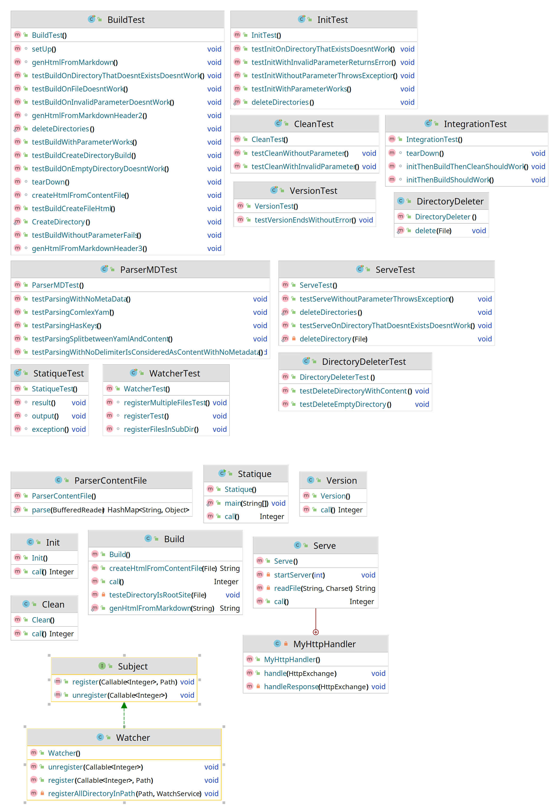
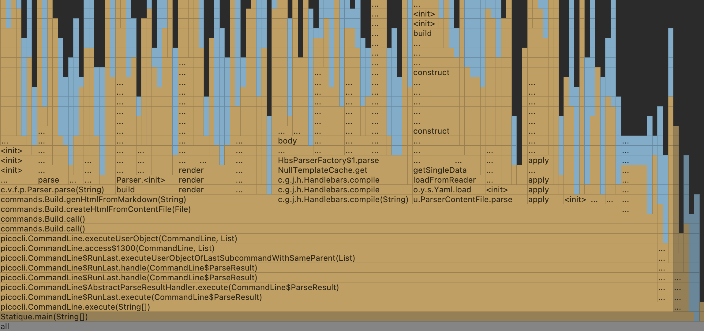
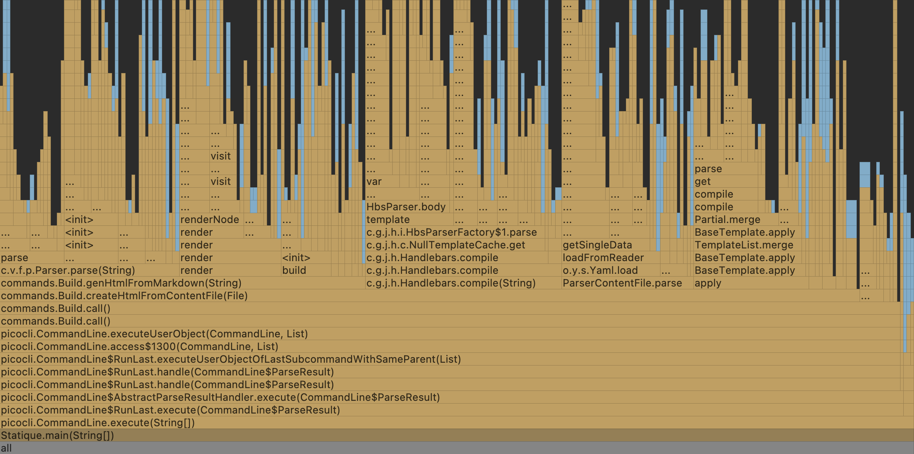
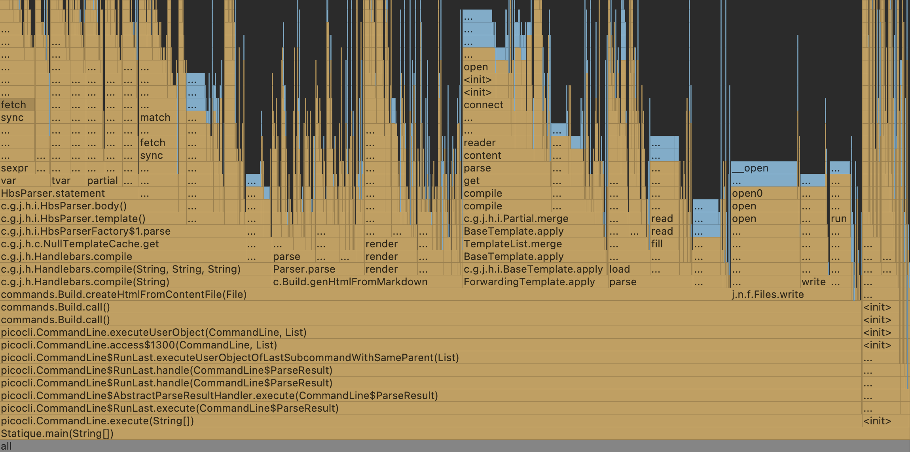
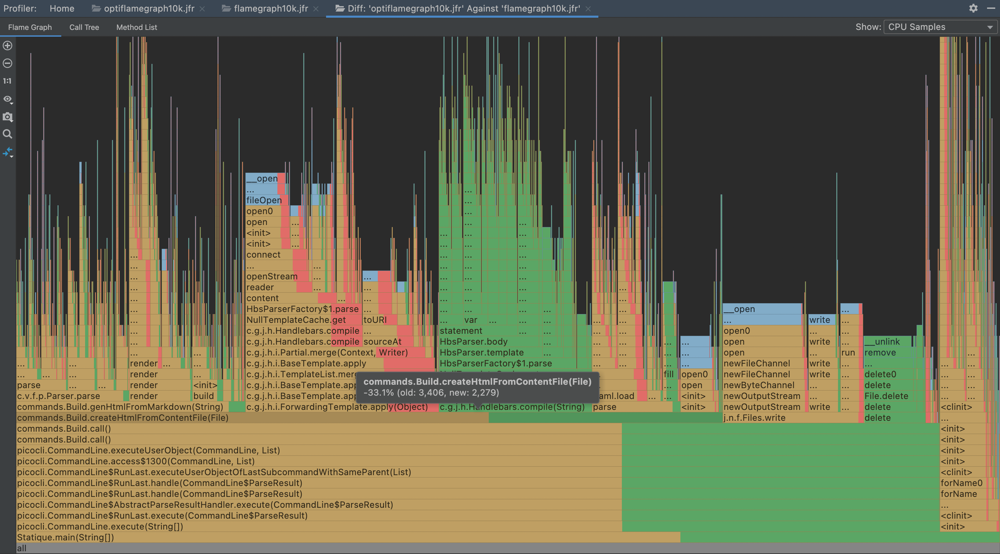
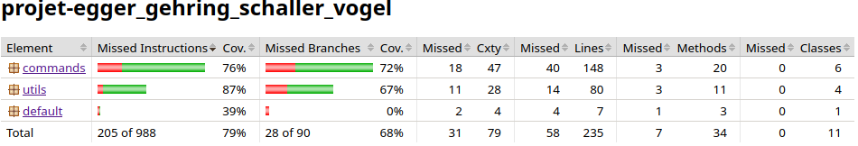
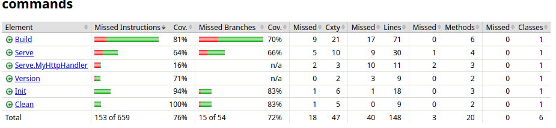
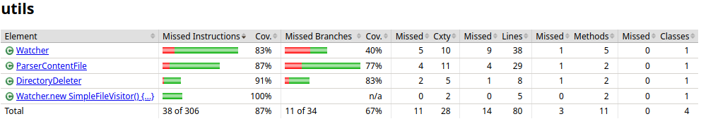
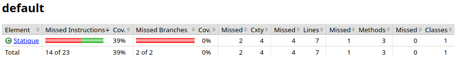
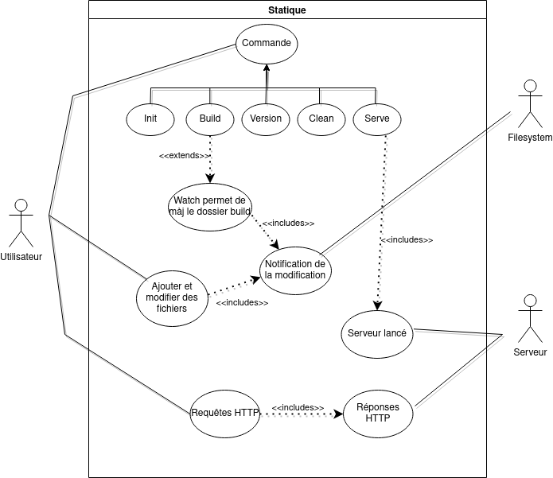

# Portfolio - Groupe Egger, Gehring, Schaller, Vogel

## Introduction 

### Présentation du contexte

Ce document contient le portfolio du projet de groupe dans le cadre du cours DIL 2022 de la HEIG-VD. Ce cours a pour but de nous faire découvrir les processus de développement en ingénierie logicielle. Notamment les processus de développement, les processus agiles, les spécifications, la conception et modélisation, la gestion des configurations et les tests, validation et performances des logiciels. C'est donc dans ce contexte que nous allons développer notre projet, qui a pour but de créer un générateur de site statique. Le projet est commissionné par l'équipe responsable du cours, M. Chapuis (Professeur) et M. Santamaria (Assistant) et ensemble ils font donc office de client et de product owner. 

### Objectif

Ce projet a pour but de mettre en pratique les méthodologies de gestion de projet vu pendant le cours de DIL notamment le processus agile. Ce processus change la dynamique de communication entre le client et l'équipe. En effet, dans les approches agiles, des itérations apparaissent entre les activités. La définition
des besoins, le design, l’implémentation et les tests s’entremêlent et s’influencent.

Ce projet développe aussi les notions suivantes : les guidelines comme "commit early, commit often" ou encore les tests continus. 

### Présentation du projet

Le programme sera écrit en java. Il inclut plusieurs librairies dont handlebars qui compile des templates en fonction JavaScript (templating). Mais également commons-io de apache pour copier des répertoires, snakeyaml pour parser les meta données en yaml et enfin flexmark-all pour transformer le contenu markdown en html. Nous avons choisi nos librairies principalement selon le nombre de stars sur github, mais aussi selon notre compréhension du getting started, ainsi que la date du dernier commit. Ces éléments nous permettent de nous situer par rapport aux différents choix de librairie possibles.

Nous avons également utilisé les librairies proposées directement par le client comme JaCoCo qui permet de calculer le degré de couverture du code par des tests unitaires et d’intégration. 

En ce qui concerne la qualité du code, nous avons choisi d'intégrer CodeClimate dans notre projet, car certains d'entre nous avaient déjà travaillé avec et cela nous semblait plus simple à intégrer sur la base de nos connaissances préalables.

### Présentation de l'équipe 

Nous sommes une équipe composée de 4 personnes : Magali Egger, Mélissa Gehring, Joris Schaller et Maëlle Vogel. Nous avons une bonne synergie, nous entendons très bien et avons l'habitude de travailler ensemble. Notre groupe ne comporte à priori pas de leader, nous avons une hiérarchie horizontale.

Notre team est très complémentaire, nous avons une bonne connaissance des différents langages de programmation. Certains d'entre nous avons déjà une expérience dans le développement de site web. Melissa a déjà suivi un cours d'ingénierie logiciel ce qui nous fournit un avantage. Joris a l'habitude de rechercher des solutions à des problèmes, des librairies déjà existantes, afin de ne pas réinventer la roue. Maëlle est très organisée et nous aide à garder un oeil sur les deadlines. Magali est touche-à-tout et est toujours là pour nous motiver et nous faire rire.

### Organisation au sein de l'équipe

Nous avons décidé de partir sur un processus logiciel agile semi-piloté afin d'avoir plus de liberté dans les étapes ultérieures du projet, nous préférons travailler de manière plus malléable.

Nous ne suivons pas exactement un framework existant. Nous participons tous ensemble à au moins une réunion par semaine afin d'organiser et de voir l'avancement du projet et des taches en cours. Lors de ces réunions, nous discutons des taches réalisées, des taches qu'il reste à accomplir, des taches accomplies et des problèmes encourus. En début de sprint, nous transformons également les stories utilisateurs en tâches.

Nous communiquons régulièrement sur un groupe Telegram, et nous nous réunissons 1 fois par semaine afin de répartir les tâches entre nous. Certaines tâches sont difficilement réalisables par une seule personne, par exemple la rédaction du portfolio ou du README, et nous nous séparons donc en sous-groupes de 2 personnes afin d'être plus efficaces dans la réalisation desdites tâches.
Lorsqu'une personne a des problèmes pour réaliser sa tâche, nous communiquons et nous nous entraidons afin de palier aux problèmes. 

## Méthodologie

### Description d'une session 

Le déroulement typique d'une session peut être décrite ainsi :

* Nous discutons ensemble des tâches à réaliser, sélectionnons les premières user stories et créons les issues correspondantes
* Chaque user story est discutée au sein du groupe 
* Nous émettons ensuite des hypothèses sur les fonctionnalités techniques nécessaires à l'implémentation de chaque story
* Nous décidons ensuite des issues qui seront créées à partir de chaque story.
* Nous attribuons 1 ou 2 personnes à chaque tâche, en équilibrant les charges autant que possible. La / les personne(s) assignée(s) estime(nt) le temps pessimiste, attendu et optimiste avant de commencer à travailler.
* Chaque personne (ou sous-groupe) commence à travailler sur sa tâche, en mettant à jour le kanban et en créant une nouvelle branche pour y travailler sans conflit sur la branche main. À la fin, l'équipe écrit des tests pour vérifier le fonctionnement de la feature.
* Une fois la tâche terminée et les tests rédigés, une pull request est créée et au moins une review est nécessaire avant de pouvoir merge la branche de la tâche sur la branche principale
* Après un review positive et la branche mergée, et on peut supprimer la branche et commencer à travailler sur la prochaine tâche

### Choix des guidelines techniques

Le nom de branche doit être clair et faire écho à la tâche qu'elle concerne. Nous utilisons en principe le format suivant pour nos branches : feature_XXX pour les features, et bug_XXX pour les bugs.

Chaque tâche doit être accompagnée de documentation complète et de tests.

Nos pull requests doivent en principe répondre aux questions suivantes:

* Qu'est-ce que cette PR va changer ?
* Pourquoi l'a-t-on changé ?
* Comment l'a-t-on testé ?
* Est-ce que cette feature va encore évoluer ?

La PR doit être accompagnée d'un "Closes #n" ou n correspond au numéro de l'issue concernée, afin qu'elle soit fermée automatiquement au moment où la PR est merge, afin de garder notre kanban à jour.
Les sprints imposés par le cours nous donnent le cadre agile de la même manière que si nous interagissions avec un client.
Nos réunions ont lieux de manière hebdomadaires durant les heures de laboratoires. Nous faisons des petits meetings au Chill de manière fortuite ou par l'intermédiaire de Telegram.
Les PR doivent avoir des commits signés.
Les PR doivent être accompagnées de tests unitaires portant sur les nouvelles fonctionnalités et avoir le code formaté selon les conventions Google.

Nous allons utiliser un système de releases pour déployer notre logiciel.

En principe nous rédigeons toute la documentation en français. 

Le format des commits dépend du type de tâche effectuée. Néanmoins, nous essayons au tant que possible de garder la forme suivante : verbe suivi de l'action ou d'une précision. Sauf dans les cas évidents, comme par exemple lors de l'ajout de documentation. En prenant un peu de recul sur cette question, et surtout en observant nos commits dans les logs, nous nous sommes rendu compte que nos commits ne sont pas toujours précis et en plus ils ne sont pas du tout uniformes. Nous avons donc des progrès à faire sur le nommage de nos commits. Par exemple, avec une structure fixée dès le début, nous aurions pu avoir des commits beaucoup plus clairs et beaucoup plus uniformes. 

Nous avons mis en place un template pour les issues, elles ont le format suivant : 

_Lié à la story #N_

_Optimiste : XhXmin_  
_Pessimiste : XhXmin_  
_Attendu : XhXmin_

## Outils

### Kanban automatique 

Le kanban a été automatisé en liant les issues entre elles et en créant les pull requests qui ferment lesdites issues.

Nous avons utilisé un kanban pour organiser nos tâches avec les colonnes suivantes : 

 * Stories utilisateur : les stories utilisateurs sont les user stories qui nous permettent de définir les tâches/issues à réaliser.
 * Tâches à réaliser : Ce sont les étapes/issues qui résolvent les stories utilisateur (problèmes) qui ne sont pas encore en cours de réalisation ou réalisées. 
 * En cours : les tâches/issues qui sont en cours de réalisation.
 * Terminé : les tâches qui ont une PR qui a été validée et qui ont été merge. Cette colonne est automatiquement mise à jour.
 * Stories réalisées : les stories qui ont été séparées en plusieurs tâches qui ont toutes été validées et merge. Cette colonne n'est pas automatiquement mise à jour, puisque plusieurs taches peuvent être liées à une story, il est difficile de l'automatiser.

## Récapitulatif des stories et des issues qui y sont reliées

Voici un tableau reprenant chaque story et qui montre les différentes issues qui y sont liées. Pour chaque story, nous avons ajouté son état actuel ainsi que d'éventuelles remarques.

| **Stories**                                        | **Tasks liées à la storie**                                                                                                                                                                                                              | **Etat Actuel** | **Remarques**                                                                                                                                                                                                                                                                                                                                                                              |
|----------------------------------------------------|------------------------------------------------------------------------------------------------------------------------------------------------------------------------------------------------------------------------------------------|-----------------|--------------------------------------------------------------------------------------------------------------------------------------------------------------------------------------------------------------------------------------------------------------------------------------------------------------------------------------------------------------------------------------------|
| Saisie des données structurées #14                 | Il n'y a pas de task liée à cette story                                                                                                                                                                                                  | Terminé         | Pas de code nécessaire pour cette story                                                                                                                                                                                                                                                                                                                                                    |
| Saisie du contenu #15                              | Il n'y a pas de task liée à cette story                                                                                                                                                                                                  | Terminé         | Pas de code nécessaire pour cette story. Nous avons choisi de faire du md                                                                                                                                                                                                                                                                                                                  |
| Format des pages #16                               | Il n'y a pas de tasks liée à cette story                                                                                                                                                                                                 | Terminé         | Pas de code nécessaire pour cette story                                                                                                                                                                                                                                                                                                                                                    |
| Affichage de la version #17                        | #26 implémenter l'option -version en utilisant picocli                                                                                                                                                                                   | Terminé         |                                                                                                                                                                                                                                                                                                                                                                                            |
| Initialiser un site statique #18                   | #30 Implémenter la méthode init à l'aide de picocli                                                                                                                                                                                      | Terminé         |                                                                                                                                                                                                                                                                                                                                                                                            | 
| Compiler un site statique #19                      | #31 Implémenter la méthode build à l'aide de picocli                                                                                                                                                                                     | Terminé         |                                                                                                                                                                                                                                                                                                                                                                                            |
| Nettoyer un site statique #20                      | #27 Implémenter la méthode clean à l'aide de picocli                                                                                                                                                                                     | Terminé         |                                                                                                                                                                                                                                                                                                                                                                                            |
| Améliorer l'intégration continue #21               | #29 Faire un merge plus restrictif                                                                                                                                                                                                       | Terminé         |                                                                                                                                                                                                                                                                                                                                                                                            |
| Release et documentation #23                       | #34 Création automatique d'une release,  #35 Création de la documentation pour l'installation                                                                                                                                        | Terminé         |                                                                                                                                                                                                                                                                                                                                                                                            |
| Server HTTP #60                                    | #62 Implémenter la commande serve à l'aide de picocli                                                                                                                                                                                    | Terminé         |                                                                                                                                                                                                                                                                                                                                                                                            |
| Moteur de template #61                             | #66 Faire des recherches,  #67 Faire la transition,  #68 Modifier la commande init,  #69 Modifier la commande build,  #70 Factoriser la génération des pages HTML,  #74 Feature changement a handlebar pour le build | Terminé         |                                                                                                                                                                                                                                                                                                                                                                                            |
| Génération du site statique à la volée #81         | #91 Implémenter l'interface Watch qui permettra l'appel de l'option --watch                                                                                                                                                              | Terminé         |                                                                                                                                                                                                                                                                                                                                                                                            |
| Code quality #86                                   | #94 Configurer LGTM pour le code quality                                                                                                                                                                                                 | Terminé         |                                                                                                                                                                                                                                                                                                                                                                                            |
| Continuous delivery #59                            | #63 Déploiement continu à l'aide de github action                                                                                                                                                                                        | Terminé         |                                                                                                                                                                                                                                                                                                                                                                                            |
| Publication du site dans un répertoire distant #82 | #92 Implémenter la commande publish                                                                                                                                                                                                      | Ouverte         |                                                                                                                                                                                                                                                                                                                                                                                            |
| Manuel utilisateur #83                             | #88 Mettre à jour le manuel utilisateur                                                                                                                                                                                                  | Terminé         |                                                                                                                                                                                                                                                                                                                                                                                            |
| Javadoc #84                                        | #89 Mettre en place la javadoc                                                                                                                                                                                                           | Terminé         |                                                                                                                                                                                                                                                                                                                                                                                            |
| Code coverage #85                                  | #90 Configurer CodeClimate pour le code coverage                                                                                                                                                                                         | Terminé         | Nous sommes tombés sur des problèmes avec Codeclimate et Jacoco. Jacoco calcule bien le coverage, mais nous n'avons pas réussi à intégrer les rapports sur Codeclimate. Nous avons décidé d'abandonner l'intégration automatique des rapports Jacoco sur Codeclimate du au manque de temps. Nous pouvons accéder aux rapports localement, comme décrits dans la section dédiée ci-dessous. |
| Code benchmarking #87                              | #93 Configurer le profiler intellij pour le benchmarking                                                                                                                                                                                 | Terminé         |                                                                                                                                                                                                                                                                                                                                                                                            |

Grâce à ce tableau, nous réalisons qu'il y a une story qui n'est pas terminée. Il s'agit de la story #82 (Publication du site dans un répertoire distant). Cette story nous paraît complexe et pas forcément utile, c'est pourquoi nous avons préféré prioriser les autres stories. Malheureusement, nous arrivons à la fin du projet et nous réalisons que nous n'avons plus le temps d'accomplir cette demande du client. Si c'était à refaire nous n'aurions pas dû repousser le traitement de cette story aussi longtemps, car si elle avait été prise en charge plus tôt nous aurions pu la terminer. Nous avons été pris de cours par les autres cours, les tests de fins de semestre et la charge de travail générale, ce qui explique notre incapacité à terminer l'entièreté du cahier de charge. 

En termes de complexité, on remarque en observant le tableau que la plupart des stories nous semblaient suffisamment simples pour etre réalisées en une seule tache. Pour la story #23, nous avons jugé pertinent de la séparer en 2 taches, une pour la documentation et une pour la release automatique. Pour la story #61, cette story était de loin la plus complexe de tout le projet. Nous l'avons séparée en 6 taches afin de pouvoir travailler en petites étapes. 

## Troubleshooting

Cette section contient les différents problèmes que nous avons encourus, les solutions que nous avons trouvées pour y faire face, ainsi que les leçons que nous en avons tirées.

| **Problème**                                                     | **Solution**                                                                  | **Leçon**                                                                                                       |
|------------------------------------------------------------------|-------------------------------------------------------------------------------|-----------------------------------------------------------------------------------------------------------------|
| Erreur dans le template d'exemple                                | Reprendre un exemple correcte                                                 | Si le code compile, il n'est pas forcement bon, vérifier le bon fonctionnement d'un effet de bord est compliqué |
| Oublier de signer le dernier commit dans une PR                  | faire un git commit --amend --signoff puis un push --force-with-lease.        | Configurer la signature automatique : git config --global commit.gpgsign true                                   |
| Oublier de signer un ancien commit dans une PR                   | Refaire une branche et prendre les changements                                | Configurer la signature automatique :  git config --global commit.gpgsign                                       |
| Oublier d'ajouter les estimations de temps                       | Ajouter les estimations par après                                             | Etre plus rigoureux lors de l'étape d'assignation des taches                                                    |
| Push sur main n'était pas bloqué                                 | Chercher d'ou vient le problème sur StackOverflow                             | Nous devrions vérifier plus assidument nos mesures de sécurités lorsque nous les mettons en place               |
| Nous avons tendance à séparer les stories en taches trop petites | Discuter après coup, reorganiser la séparation des stories en moins de taches | La séparation en taches est complexe, mais avec un peu de communication cela devient plus facile                |

## Comparaison entre les temps attendus et les temps effectués

Ce tableau reliant les tasks avec le temps estimé et le temps nécessaire à chaque issue. L'objectif est d'avoir ces résultats regroupés afin de pouvoir faire une analyse plus appronfondie du temps nécessaire aux différentes tâches et le degré de complexité des issues de manière à pouvoir avoir un retour sur les parties qui ont le plus posées problème et celle qui au contraire, ce sont déroulées avec facilité.

| **Task**                                                                                                                                                    | **Temps pessimiste** | **Temps attendu** | **Temps optimiste** | **Temps réel** | **Remarques**                                                                                                 |
|-------------------------------------------------------------------------------------------------------------------------------------------------------------|----------------------|-------------------|---------------------|----------------|---------------------------------------------------------------------------------------------------------------|
| Configurer CodeClimate pour la code quality #94                                                                                                             | 2h                   | 1h                | 30min               | 30min          |                                                                                                               |
| Configurer le profiler intellij pour le benchmarking #93                                                                                                    | 1h                   | 45min             | 30min               | 1h             |                                                                                                               |
| Implémenter l'interface Watch qui permettra l'appel de l'option --watch #91                                                                                 | 4h                   | 2h                | 1h30                | 2h             |                                                                                                               |
| Configurer Codeclimate pour le code coverage #90                                                                                                            | 2h                   | 1h                | 30min               | 3h             | Nous sommes tombés sur des problèmes ce qui explique le temps plus élevé que prévu                            |
| Mettre en place la Javadoc #90                                                                                                                              | 2h                   | 1h                | 30min               | 30min          |                                                                                                               |
| [BUG] Clean ne supprime pas le dossier #77                                                                                                                  | 2h                   | 1h30              | 1h                  | 1h             |                                                                                                               |
| Modifier la commande init afin d'intégrer les templates HTML #68                                                                                            | 2h                   | 1h                | 30min               | 10min          | Moins de temps que prévu car la tâche était déjà faite dans build                                             |
| Faire la transition afin de changer de pandoc vers le moteur de templates choisi #67                                                                        | 7h                   | 4h                | 2h                  | 9h             | Plus de travail que prévu et des bugs à corriger                                                              |
| Faire des recherches sur les différents moteurs de templates disponibles pour voir ce qui nous convient #66                                                 | 30min                | 15min             | 10min               | 15min          |                                                                                                               |
| Écrire des test d'intégration et des tests systèmes #65                                                                                                     | 1h                   | 30min             | 20min               | 25min          |                                                                                                               |
| Mettre en place un déploiement continu à l'aide de GitHub actions #63                                                                                       | 2h                   | 1h30              | 1h                  | 3h             | Sans connaissances au préalable faire l'action a pris plus de temps que prévu                                 |
| Implémenter la commande "serve" à l'aide de picocli #62                                                                                                     | 2h                   | 1h30              | 1h                  | 4h             | Le temps attendu a été sous-estimé et la difficulté était plus grande qu'attendue                             |
| Faire des templates de PR et issue #56                                                                                                                      | 30min                | 15min             | 10min               | 15min          |                                                                                                               |
| [BUG] Empecher de push sur main #54                                                                                                                         | 15min                | 10min             | 5min                | 15min          | Nous avons du tester plusieurs méthodes afin de vérifier que main était bien protégée, ce qui a pris du temps |
| Implémenter la méthode build à l'aide de picocli #31                                                                                                        | 4h                   | 2h30              | 1h30                | 3h             | La création des tests a pris plus de temps que prévu                                                          |
| Implémenter la méthode init à l'aide de picocli #30                                                                                                         | 2h                   | 1h30              | 1h                  | 1h30           |                                                                                                               |
| Ajouter une condition qui empêche de merge une pull request si la compilation ou les tests produisent des erreurs, ou si le code n'est pas bien formaté #29 | 4h                   | 2h                | 1h30                | 2h             |                                                                                                               |
| Implémenter la méthode clean à l'aide de picocli #27                                                                                                        | 3h                   | 2h                | 1h                  | 1h30           |                                                                                                               |
| Implémenter l'option -version en utilisant picocli #26                                                                                                      | 1h                   | 30min             | 20min               | 35min          |                                                                                                               |
| Traduire les différents contenus en français #25                                                                                                            | 3h                   | 1h30              | 1h                  | 45min          | Plusieurs personnes ont participé ce qui a réduit le temps.                                                   |
| Mettre à jour le manuel utilisateur #88                                                                                                                     | 2h                   | 1h                | 30min               | ??             | Nous n'avons pas noté combien de temps nous avons passé sur cette tache                                       |
| Refactor le code pour utiliser la correction de l'enseignant #22                                                                                            | 2h                   | 1h                | 30min               | ??             | Nous n'avons pas noté combien de temps nous avons passé sur cette tache                                       |
| [BUG] Corriger index.md #46                                                                                                                                 | 15min                | 10min             | 5min                | ??             | Nous n'avons pas noté combien de temps nous avons passé sur cette tache                                       |
| Création de la documentation pour l'installation #35                                                                                                        | 1h30                 | 1h                | 30min               | ??             | Nous n'avons pas noté combien de temps nous avons passé sur cette tache                                       |

Nous pouvons constater que plus le projet avance, plus nous avons été précis dans le calcul de temps nécessaire à chaque tasks. Cela est probablement dû à une meilleure compréhension du projet dans son ensemble ainsi qu'une meilleure gestion des outils. Dans l'ensemble nous avons plutôt bien géré les estimations, à quelques exceptions près qui sont décrites dans la rubrique Remarques. Certaines taches ne figurent pas dans le tableau, car nous n'avions pas fait d'estimations, dû à un manque de discipline.

## Retour sur le Sprint 1

### Choix techniques

Avant de commencer ce sprint, nous avons évalué nos possibilités pour fournir un outil capable de générer un site statique, l'utilisation d'un moteur de template
comme [mustache](https://github.com/spullara/mustache.java) a été envisagé, mais après discussion, nous avons trouvé que pandoc répondait mieux aux exigences et était plus
simple à prendre en main. Pandoc permet de générer des fichiers html à partir d'un fichier md suivant un template précis. Ceci nous a permis de regrouper les 3 premières stories en une seule task, à savoir d'utiliser Pandoc.
Nous n'avons pas écrit de tests avant de commencer à implémenter les features, nous les avons faits par après pour en vérifier le fonctionnement. Nous envisageons de réaliser des tests avant de commencer à programmer pour les prochains sprints.

### Organisation des issues

Nous avons aussi remarqué, lors du découpage des stories en issues, que c'était plus compliqué que prévu et que le découpage d'un problème réel en une solution informatique créait des conflits d'organisation. En effet, lors de ce premier sprint les stories étaient simples et nous avons donc eu une seule issue par story, Nous avons donc eu une issue et une user story pour une tâche. Grâce à notre règle de mettre dans la PR close #n, l'issue était fermée mais la story pas forcément.
Le découpage a été immédiatement fait au début alors que nous aurions pu attendre un peu et le faire de manière incrémentale.

### Gestion du repository

Nous avons réalisé par erreur que nos mesures de sécurités pour empecher de push sur la branche main sans passer par des pull requests ne fonctionnait pas. Il fallait ajouter cette règle aux administrateurs également, ce que nous n'avions pas fait.

### Continuous Integration Continuous Delivery

Nous avons décidé de mettre très tôt une cicd github afin d'automatiser les tests et de pouvoir faciliter les reviews.
Nous avons aussi choisis un style de code(Google) et l'avons rendu obligatoire dans la codebase à l'aide d'un teste du cicd.
Cependant, afin de ne pas avoir un commit qui formate toute la codebase, nous l'avons configuré de sorte à n'avoir le test que sur les fichiers différents de la branche main ainsi, une personne peut commit et push (et merge si sa PR répond aux exigences) sans être bloqué par la pipeline cicd à cause de fichiers non modifiés qui ne sont pas correctement formaté.

## Retour sur le Sprint 2

### Etat actuel du projet

Nous sommes passés de pandoc à handelbars car avec l'ajout des templates, l'utilisation de pandoc devenait compliquée.
La commande build a été mise à jour pour utiliser handelbar et prendre en compte les templates.

Hélas la continuous delivery n'a pas pu être mise en place par manque de temps. De plus, nous n'avons pas pu implementer la commande init, car la personne en charge de cette issue s'est trouvé submergée par d'autres projets (Baleinev) et n'a donc pas pu terminer cet aspect du sprint. Néanmoins, nous avons pu mener à bien ce sprint grâce à l'investissement et le travail accompli par le groupe 

### Methode de conception 

Lors de ce sprint, nous avons tenté de mettre en place une méthode de conception, en commençant par brain-stormer sur le projet à l'aide de petites notes et de croquis dans le but d'explorer plusieurs idées, par exemple sur les outils à utiliser ou encore sur l'architecture des dossiers. La plupart des idées émises ont finalement été abandonnées, mais cette méthode nous a au moins permis de nous mettre d'accord sur certains aspects du projet. 
Nous n'avons pas beaucoup travaillé avec la notion de décomposition, mais avec du recul, nous avons réalisé que nous cela nous aurait aidé de décomposer le projet. Notamment en modélisant les interactions des différents composants. Par exemple à l'aide d'un diagramme de séquence. 

### Refactoring

Nous nous en sommes plutôt bien sortis avec l'aspect de refactoring du code. Cela peut être une opération problématique si elle n'est pas faite consciencieusement. Il n'est pas toujours évident de changer un code déjà implementé dans le but de le réutiliser dans un autre projet. Cela nous a demandé de nous y préparer en amont de réfléchir à ces questions avant de coder. Cela a été intéressant de constater que nous n'étions pas tout de suite d'accord sur la façon de procéder. L'outil de refactoring d'intellij nous a été très utile. En effet, il est simple à utiliser et permet d'éviter que le code devienne un véritable champs de bataille, lors de ce processus.

### Comparaison des temps attendus et actuelles

Nous avons souvent pris plus de temps qu'attendu car nous avons plusieurs projets en parallèle. Toujours devoir se replonger dans le code nous fais perdre du temps. Nous commençons à tirer des leçons concernant la gestion de temps de travail. En effet, nous avons réalisé que nous sous-estimons le temps nécessaire pour une issue, car nous ne prenons pas suffisamment en compte les problèmes potentiels. De plus, nous ne considérons pas toujours le temps nécessaire à l'acquisition de nouvelle compétence, ainsi que les délais engendrés par le fait de jongler entre plusieurs projets et plusieurs cours. 

### Automatisation

Nous avons exploré l'automatisation en mettant en place un système automatique pour les messages des commits. Beaucoup d'autre aspects du projet auraient pu être automatisés. Mais nous avons craint que la mise en place de ces automatisations prennent plus de temps que de continuer le projet sans cela. Ce choix est difficile, car il nécessite d'avoir une bonne connaissance des besoins à venir du projet ainsi que sa temporalité.

### Ce qui pourrait être amélioré

Nous pourrions tenir à jour le portfolio plus souvent pour éviter de devoir tout écrire au dernier moment. En effet, nous sommes souvent plus concentrés sur le code que sur la gestion du projet en lui-même. Ce qui peut engendrer des problèmes organisationnels et ainsi nuire à la qualité du travail fourni. 
Les tests devraient être écrits avant la rédaction du code. Une bonne solution pourrait être de les écrire en pseudo-code pour savoir à quoi s'attendre et ainsi avoir une meilleure idée de ce à quoi nous attendre. 

### Ce qui doit être continué pendant le prochain sprint

Nous devons encore ajouter la continuous delivery. 

## Retour sur le Sprint 3

### Conception incrémentale
Lors de ce sprint, nous avons pu intégrer des méthodes de conception incrémentale notamment grâce à l'utilisation du diagramme de classe. Nous avons fait le choix d'utiliser l'outil d'intellij qui permet de générer un diagramme automatiquement à partir du code. Nous avons trouvé cette solution pratique, car elle est très rapide à mettre en place et permet de bien visualiser l'organisation et l'architecture du code. 

Sur ce diagramme, nous pouvons observer que les classes les plus importantes sont vers le bas. Les classes du haut sont principalement les classes de tests, qui nous intéressent moins. La classe DirectoryDeleter permet de supprimer un dossier / fichier. La classe ParserContentFile est une classe utilitaire qui permet de parser des fichiers. Les classes Version, Init, Build, Clean et Serve sont des classes implémentant l'interface Callable et qui implémentent les commandes correspondantes. Serve possède également une classe interne MyHttpHandler afin de lancer le server local. Finalement, l'interface Subject, et Watcher qui l'implémente, permettent de notifier un callable lorsque le sujet change.

### Refactoring

En ce qui concerne le refactoring nous avons eu plus de difficultés qu'au sprint 2. En effet, le refactoring est un processus long à mettre en place, et lors de ce sprint, nous avons eu moins de temps disponible à consacrer à l'avancement du projet dû aux autres cours et à l'approche de la fin du semestre. 

### Tests d'intégration et tests systèmes

Concernant les tests, nous avons établi que les pull requests ne sont acceptées que si elles contiennent des tests. Ce mécanisme permet donc d'être sûr que toutes les fonctionnalités soient testées.
Nous avons rajouté un test qui effectue plusieurs commandes à la suite notamment : init build clean. Ce test fonctionne ce qui montre que les commandes ont un comportement normal. Nous avons aussi implementé un test qui effectue seulement la commande build pour vérifier qu'effectuer cette commande seule ne fonctionne pas. 

### Automatisation

Nous avons mis en place github Action afin de faire la release automatique au moment où un membre de l'équipe push un tag (la pull request a été squash and merge). Il liste tous les nouveaux commits depuis la dernière release et il prépare le jar afin de l'ajouter à la release afin d'obtenir le même résultat que lorsque nous faisions les releases à la main. 
Nous avons également mis en place un template pour les issues.

### Etat actuel du projet

Actuellement le watch service fonctionne et les commandes build et serve l'ont implémenté. Afin de proposer une interface simple et concise, nous avons imaginé une interface que la classe Watch implémente. L'interface proposée est minimaliste et permet de cacher la complexité. Puisque les classes de commandes sont des Callable<Integer>,
nous avons décidé de proposer une fonction qui prend en paramètre un chemin et un Callable, la méthode call de ce dernier est appelée lorsqu'un changement est détecté dans le dossier indiqué par le chemin ou un sous répertoire.
Nous avons rencontré un problème avec le template de pull requests. Il ne s'applique pas comme il le devrait. Nous n'avons donc pas pu utiliser un template de pull request à remplir. Ce qui nous a empêché de faire certaines pull requests. Ce bug a impliqué que nos pull requests n'ont pas toutes le même format.
  
### À continuer au prochain sprint
  
Nous n'avons pas pu avancer beaucoup sur nos tâches. Cela est dû au manque de temps et à la quantité de travail qui devient de plus en plus importante. 
Etant donné la situation, nous nous sommes réuni pour discuter des problématiques rencontrées lors de ce sprint. Nous avons cerné le fait que ce sprint 3 n'avait pas été mis suffisamment en priorité par rapport à d'autres tests et laboratoires et que cela devait changer afin que le travail fournit au sprint 4 puisse être suffisant. 
Nous allons donc reporter sur le prochain sprint les stories suivantes : 

- code benchmarking
- code quality
- code coverage
- Javadoc
- Manuel utilisateur
- Publication du site dans un répertoire distant

Nous aimerions également rajouter dans le cadre de la continous integration continous delivery le fait de pouvoir faire tourner notre programme sur différents OS. Actuellement, nous utilisons uniquement ubuntu. Mais nous aimerions rajouter windows, mac, et d'autres.

## Retour sur le Sprint 4
Durant le sprint 4 nous avons consolidé certaines parties du projet.

### Profiling 
Nous avons donc, avec un peu de retard, profilé le code. Afin de voir si le programme était scalable nous avons profilé l'exécution lors de la construction d'un site de 3, 100 et 10'000 pages.

Nous pouvons observer que l'exécution est similaire pour les trois cas, cependant quatre zones se démarquent sur le flamegraphe durant la compilation du site. Il s'agit des actions essentielles propres à la méthode CreateHtmlFromContentFile.
Pour rappel: nous avons défini un fichier de "contenu" comme un fichier dans le dossier content finissant en .md et contenant une partie de meta-information (en yaml) et une partie de contenu (en markdown).
La transformation d'un fichier de contenu se fait en 4 étapes visibles sur le graphe.
 - Le parsing en contenu et meta-donnée
 - Transformation du contenu markdown en html
 - Compilation du layout en template
 - Injection du contenu et des meta-données dans le template
Voici les un tableau récapitulant les temps pris par chaque étape. en % du temps du parent

| # de fichier | parsing en contenu et meta donnée | markdown à html | Compilation du layout en template | Injection  dans le template | temps total |
|--------------|-----------------------------------|-----------------|-----------------------------------|-----------------------------|-------------|
| 3            | 17%                               | 47%             | 20%                               | 5%                          | 0.525s      |
| 100          | 15%                               | 42%             | 22%                               | 13%                         | 0.710s      |
| 10'000       | 10%                               | 28%             | 36%                               | 19%                         | 7.225s      |

On peut voir que lorsque le nombre de fichiers augmente, la méthode qui convertit le markdown en html semble se faire optimiser.

On peut aussi noter que la compilation du layout a lieu à chaque fichier, alors que c'est toujours le même layout pour tous les fichiers. En déplaçant hors de la fonction la compilation du template, nous pouvons améliorer grandement notre performance.
Après avoir fait le changement, nous avons re-profilé le code avec 10'000 fichiers.
Voici la différence entre le premier flamegraph et le second.

Nous pouvons voir qu'une étape entière de la procédure de création d'un fichier de contenu à un fichier html est supprimée et que nous avons un gain de 33% pour la méthode createHtmlFromContentFile. Ainsi comme cette méthode prenait la majorité du temps, nous avons un temps de compilation qui descend à 5.1 s à la place des 7.225 de départ !

Pour les prochaines optimisations possibles, mais que nous n'allons pour le moment pas implémenter, nous retenons l'application des données au template de layout qui occupe beaucoup de temps. Il se peut que changer de librairie offre une amélioration, nous envisageons aussi de regarder la documentation en détail pour voir s'il y a des conseils en termes de performance.

### Code coverage

Nous avons mis en place Jacoco afin d'avoir un feedback sur le coverage de nos tests pour notre code. Malheureusement, comme cité plus haut, nous avons eu des problèmes pour intégrer les rapports générés par Jacoco sur Codeclimate, probablement à cause d'un format incorrect, mais nous n'avons pas trouvé de solution pour palier à ce problème. Voilà donc des screenshots du rapport Jacoco généré sur le code tel dans l'état final.

Nous pouvons observer que nous avons un total de 79% de notre code qui est couvert par les tests, ce qui est relativement bon. Nous aurions pu produire plus de tests afin d'augmenter le coverage, mais le temps nous a fait défaut.

Dans le package commands, on observe que c'est principalement Serve qui manque de tests, plus particulièrement la classe interne Serve.MyHttpHandler avec uniquement 16% de coverage.

Dans le package utils, on a un code qui est couvert à plus de 80% à chaque fois, ce qui est plutôt bon.

Dans le package default, on voit que la classe Statique est testée à 39%, ce qui n'est manifestement pas beaucoup. Nous aurions également pu développer plus de tests pour cette classe.

### Code quality

En ce qui concerne la qualité du code, nous avons configuré Codeclimate afin d'obtenir un feedback. Nous avons également ajouté dans le README des badges qui indiquent si le build maven passe, et la note que CodeClimate attribue à notre projet. Nous obtenons la note C, car il y a plusieurs code smells présents dans notre code qui pourraient etre supprimés, mais que nous n'avons malheureusement pas eu le temps de gérer avant la fin du projet.

### Javadoc

Durant ce sprint, nous avons également mis en place de la Javadoc afin d'avoir une meilleure documentation de nos méthodes et de nos interfaces publiques.

### Use case

Nous avons fait un use case diagram pour l'utilisation de notre application. L'utilisateur peut appeler plusieurs commandes et modifier, ajouter, supprimer des fichiers et des dossiers.

### TDD

Nous avons réalisé un peu trop tard que le TDD était une des demandes pour le projet. Au moment où nous avons voulu le mettre en place, nous n'avions plus rien à coder. Nous n'avons pas appliqué le TDD à proprement parlé, mais dans les sprints précédents nous avons beaucoup communiqué avant de commencer l'implémentation de certaines classes, nous avons discuté ensemble de ce que devait faire la classe et de comment nous pouvions la tester, ce qui se rapproche plus ou moins d'un développement test-driven.

## Commentaires finaux

Pour conclure, nous voulions effectuer quelques commentaires d'ensemble sur le projet et son déroulement. Nous sommes conscients du fait que notre gestion du processus n'était pas toujours idéale. Nous avons parfois manqué de discipline principalement dû au fait que nous avons été submergés par la charge de travail de ce semestre. Nous avons souvent mis la priorité sur les autres cours, délaissant le projet, ce qui nous a porté préjudice, notamment sur les points suivants :

* L'assignation des taches à des personnes et le déplacement des issues dans le Kanban n'était pas fait systématiquement, ou parfois en retrospective. 
* Nous oublions parfois d'utiliser le template mis en place pour les issues, ce qui se répercutait également sur les estimations de temps qui manquaient parfois
* Le format discuté pour les PRs n'a pas toujours été respecté, ce qui se répercutait également sur le temps réel qui n'était pas toujours documenté.

Malgré tous ces petits soucis de discipline, nous sommes tout de meme satisfaits globalement avec la manière dont nous avons géré le processus. Ça n'a pas toujours été parfait, mais nous nous sommes améliorés avec le temps, et à long terme nous aurions certainement pu appliquer les différents stratagèmes de manière totalement automatique.

Ce projet nous a permis d'appliquer les principes vus en cours dans un contexte tout à fait concret, et nous sommes maintenant bien plus à l'aise avec l'organisation de projet en groupe. Nous sommes tous globalement satisfaits de notre projet. 
